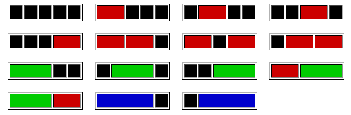

# Bandes rouges, vertes et bleues I
`Difficulté : Moyen (30%)`
`Origine : Projet Euler n°116`

On considère une bande de longueur 5 cases noires qu'on peut recouvrir avec des bandes de différentes couleurs : rouges (de longueur 2), vertes (de longueur 3) et bleue (de longueur 4).

Si on choisit les bandes rouges, il y a exactement 7 façons de le faire :

Si on choisit les bandes vertes, il y a 3 façons de le faire : 

		
Et si on choisit les bandes bleues, il y a 2 façons de la faire.

En supposant que les couleurs ne peuvent pas êtres mélangées, il y a 7 + 3 + 2 = 12 façons de placer des bandes colorées sur une bande de longueur 5 au total.

De combien de façons peut-on recouvrir une bande noire de longueur 50 avec des bandes de couleurs rouges, vertes et bleues et sans mélanger les couleurs ?

Note : Ce problème est en relation avec le problème 117.

On affichera le résultat avec `print`.

@[Bandes rouges, vertes et bleues I]({"stubs": ["Defis/Euler_116.py"], "command": "python3 Defis/Euler_116_Test.py"})

---

# Bandes rouges, vertes et bleues II
`Difficulté : Moyen (35%)`
`Origine : Projet Euler n°117`

En utilisant des combinaisons de cases noires et de bandes rouges mesurant 2 cases, de bandes vertes mesurant 3 cases et de bandes bleues de longueurs 4 cases, il est possible de recouvrir une bande de 5 cases de longueur d'exactemennt 15 façons différentes : 

De combien de façons peut-on recouvrir une bande de mesurant 50 cases ?

On affichera le résultat avec `print`.

@[Bandes rouges, vertes et bleues II]({"stubs": ["Defis/Euler_117.py"], "command": "python3 Defis/Euler_117_Test.py"})

---

# Ensembles pandigitaux de nombres premiers 
`Difficulté : Moyen (45%)`
`Origine : Projet Euler n°118`

En utilisant tous les chiffres de 1 à 9 et en les concaténant librement pour former des entiers, on peut former différents ensembles. Par exemple l'ensemble {2,5,47,89,631} est remarquable car il ne contient que des nombres premiers

Combien d'ensembles distincts contenant chaque chiffre de un à neuf exactement une fois contiennent uniquement des nombres premiers ?

On affichera le résultat avec `print`.

@[Ensembles pandigitaux de nombres premiers ]({"stubs": ["Defis/Euler_118.py"], "command": "python3 Defis/Euler_118_Test.py"})

---

# Puissances de sommes de chiffres
`Difficulté : Moyen (30%)`
`Origine : Projet Euler n°119`

Le nombre 512 est intéressant car il est égal à la somme de ses chiffres élevé à une certaine puissance : 5 + 1 + 2 = 8 et $`8^3=512`$. Un autre exemple d'un tel nombre est 614656 = $`28^4`$.

On peut ainsi définir $`a_n`$ comme le n-ième terme de cette suite de nombres en précisant que de tels nombres doivent avoir au moins 2 chiffres pour pouvoir en faire la somme.

Ainsi on a $`a_2 = 512`$ et $`a_{10} = 614656`$ 

Trouver $`a_{30}`$

On affichera le résultat avec `print`.

@[Puissances de sommes de chiffres]({"stubs": ["Defis/Euler_119.py"], "command": "python3 Defis/Euler_119_Test.py"})

---
