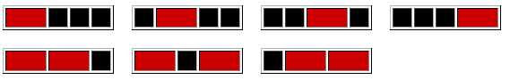

# Bandes rouges, vertes et bleues
`Difficulté : Moyen (30%)`
`Origine : Projet Euler n°116`

On considère une bande de longueur 5 cases noires qu'on peut recouvrir avec des bandes de différentes couleurs : rouges (de longueur 2), vertes (de longueur 3) et bleue (de longueur 4).

Si on choisit les bandes rouges, il y a exactement 7 façons de le faire :

Si on choisit les bandes vertes, il y a 3 façons de le faire : 

		
Et si on choisit les bandes bleues, il y a 2 façons de la faire.

En supposant que les couleurs ne peuvent pas êtres mélangées, il y a 7 + 3 + 2 = 12 façons de placer des bandes colorées sur une bande de longueur 5 au total.

De combien de façons peut-on recouvrir une bande noire de longueur 50 avec des bandes de couleurs rouges, vertes et bleues et sans mélanger les couleurs ?

Note : Ce problème est en relation avec le problème 117.

On affichera le résultat avec `print`.

@[Bandes rouges, vertes et bleues]({"stubs": ["Defis/Euler_116.py"], "command": "python3 Defis/Euler_116_Test.py"})

---
