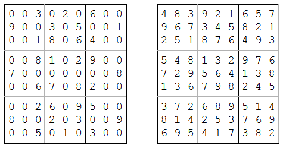

# Su Doku
`Difficulté : Moyen (25%)`
`Origine : Projet Euler n°96`

Su Doku est le nom donné à un concept de puzzle populaire. Son origine n'est pas claire, mais le crédit peut être attribué à Leonhard Euler qui inventa un puzzle similaire et beaucoup plus difficile appelé carrés latins. L'objectif d'un Su Doku est de remplacé tous les blancs (ou les zéros) d'une grille 9 par 9 tels que chaque ligne, colonne et bloc 3 par 3 ne contienne qu'un seul chiffre de 1 à 9. Ci dessous un exemple d'une grille de départ et de sa solution.

Une grille de Su Doku bien construite a une unique solution et peut-être résolue par logique, cependant, il peut être necessaire de deviner et tester des chiffres pour éliminer des options. La complexité de la recherche détermine la difficulté du puzzle. L'exemple ci dessus est considéré comme facile car il peut être résolu par une déduction directe.

On donne ci-dessous une liste de 50 grilles (sous forme de tableau 9 par 9) rangées par difficulté ayant chacune une unique solution. Le premier de la liste est celui présenté en exemple ci-dessus.

En résolvant les 50 grilles, trouver la somme des nombres de 3 chiffres qui se trouve dans le coin supérieur gauche de chaque grille. Par exemple 483 est le nombre de 3 chiffres qui se trouve dans la grille solution de l'exemple.

On affichera le résultat avec `print`.

@[Su Doku]({"stubs": ["Defis/Euler_96.py"], "command": "python3 Defis/Euler_96_Test.py"})

---

# Grand nombre premier qui n'est pas un nombre de Mersenne
`Difficulté : Facile (5%)`
`Origine : Projet Euler n°97`

Le premier nombre premier trouvé excedant un million de chiffre a été découvert en 1999 et est un nombre de Mersenne premier de la forme $`2^{6972593}−1`$; Il contient exactement 2,098,960 chiffres. Ensuite, un autre nombre de Mersenne premier a été trouvé contenant davantage de chiffres.

Cependant, en 2004, il a été trouvé un énorme nombre premier qui n'est pas de Mersenne contenant 2,357,207 chiffres : $`28433×2^{7830457}+1`$.

Trouver les 10 derniers chiffres de ce nombre premier.

On affichera le résultat avec `print`.

@[Grand nombre premier qui n'est pas un nombre de Mersenne]({"stubs": ["Defis/Euler_97.py"], "command": "python3 Defis/Euler_97_Test.py"})

---
