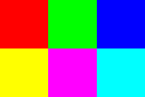

# Manipulations d'images (Première partie)

Le but de cette page est de présenter quelques façons de manipuler les images "à la main" c'est à dire sans utiliser les fonctions déjà toutes faites dans un module. Cette présentation est très largement inspirée d'un très bon cours de [CG]Maxime de ce site mais plus sous forme d'exercices et en français. J'ai, de plus, fait le choix de transformer les images en tableau numpy car je trouvais la façon de faire plus "mathématique".

Remarques :  
De base, on charge la photo [Lenna](https://en.wikipedia.org/wiki/Lenna) utilisée classiquement dans les présentations de manipulations de photos. mais vous pouvez utiliser une autre photo en remplaçant `image=np.asarray(image_entrée)` par le tableau numpy de votre photo.  
Il n'y a pas d'autocorrection ici. Si le code est valide, la barre s'affichera en vert même s'il ne répond pas à la question.

## Le script de base 

Juste quelques mots sur ce qui apparait de base dans les scripts qui vont suivre :

@[Le script de base]({"stubs": ["Info/Manip_image_base.py"], "command": "sh -c 'python3 Info/Manip_image_base.py  && python3 Info/afficher_images.py'"})

Tout d'abord, on importe le module PIL qui permet la manipulation d'image (ici elle nous servira principalement pour ouvrir et sauvegarder une image, étant donné que l'on va plutôt manipuler à la main nos données).
On importe aussi numpy qui permet de travailler assez facilement avec des tableaux de données (entre autre).

Ensuite, On ouvre notre image puis on la traduit en tableau numpy. Du coup, chaque pixel est représenté dans le tableau par un triplet (r,v,b) où r, v et b sont des nombres entre 0 et 255 représentant la "proportion" de rouge, vert et bleu respectivement dans la couleur de ce pixel. Attention : les pixels sont reprérés dans le tableau par la ligne et la colonne (comme dans une matrice). Autrement dit, pour récupérer le pixel tout en bas à gauche, on utilisera `image[511,0]` (car l'image est de dimension 512 par 512). Ce n'est donc pas la notation standard en coordonnées mais plutôt celle des matrices.

On récupère ensuite les dimensions de l'image. `nb_lignes` représente le nombre de lignes de notre tableau et `nb_colonnes` le nombre de colonnes.

La partie centrale où est défini `image_sortie` sera à modifier en fonction des manipulations.

Enfin la partie finale du script sauvegarde les images pour pouvoir les afficher.

Si vous appuyez sur Run, vous verrez s'afficher à gauche l'image initiale et à droite l'image modifiée. ** Ne pas hésiter à relancer une deuxième fois s'il affiche un message d'erreur anormal**

### L'image sous forme de tableau de valeurs

Pour bien comprendre sous quelle forme est l'image, voici un exemple simple d'une image de dimension 2 lignes et 3 colonnes qu'on transforme en tableau numpy dont on affiche le contenu (avec print). Voici l'image de cet exemple grossie pour pouvoir voir les 6 pixels : 

@[Affichage du tableau numpy]({"stubs": ["Info/Manip_image_tab_np.py"], "command": "python3 Info/Manip_image_tab_np.py  "})

On peut ainsi voir que chaque pixel du tableau est représenté par un triplet de trois nombres correspondant à la couleur du pixel en RVB.

## Couper ou rogner une image

Commençons par la transformation la plus facile : récupérer une partie d'une image.

Pour cela il suffit de ne prendre qu'une partie de notre tableau de données. C'est très facile avec un tableau numpy : `image[2:6,3:9]` permet de récupérer la zone entre la ligne 2 et 5 et la colonne 3 et 8 (car comme d'habitude en python on ne prend pas la dernière valeur).

Si on souhaite récupérer le regard de Lenna, on peut récupérer la zone entre les lignes 240 et 290 et les colonnes 240 et 360.  
Remarque pratique : Pour avoir les coordonnées d'une zone, il suffit d'ouvrir l'image avec paint par exemple et ballader la souris sur l'image. Les coordonnées s'affichent en bas.

Remplacer les ... par ce qu'il faut pour récupérer en sortie le regard de Lenna.

@[Rogner une image]({"stubs": ["Info/Manip_image_rogner.py"], "command": "sh -c 'python3 Info/Manip_image_rogner.py  && python3 Info/afficher_images.py'"})

## Retourner

Pour retourner une image (par exemple inverser gauche-droite), il suffit simplement que sur chaque ligne, on mette dans le pixel situé à la colonne `col` la valeur du pixel de la colonne `nb_colonnes-1-col` de l'image originale.

Compléter le script suivant pour qu'il inverse l'image horizontalement puis essayer de le modifier pour faire une inversion verticale :

@[Retourner une image]({"stubs": ["Info/Manip_image_retourner.py"], "command": "sh -c 'python3 Info/Manip_image_retourner.py  && python3 Info/afficher_images.py'"})

## Inverser les couleurs 

Pour inverser les couleurs, il suffit de remplacer chaque couleur de valeur `v` par la valeur `255 - v`.

Compléter le script suivant pour qu'il inverse les couleurs de toute l'image.

::: Astuce numpy
Avec les tableaux numpy, on peut appliquer très simplement une opération simple à tout un tableau d'un coup. Par exemple, pour ajouter 3 à toutes les valeurs d'un tableau nommé `t`, il suffit d'écrire `t+3`. Le résultat est alors un tableau identique à `t` mais avec toutes les valeurs augmentées de 3.  
On peut ainsi, en une seule ligne, faire l'inversion des couleurs sans avoir à faire de boucles.
:::

@[Inverser les couleurs d'une image]({"stubs": ["Info/Manip_image_inversion_couleurs.py"], "command": "sh -c 'python3 Info/Manip_image_inversion_couleurs.py  && python3 Info/afficher_images.py'"})

## Ne garder qu'une couleur

A partir d'une image, on peut en créer 3 différentes dans laquelle on ne garde que la composante rouge, verte ou bleue de chaque pixel. L'image originale étant alors la superposition des trois.

Pour cela, il suffit simplement de garder la valeur de la couleur souhaitée et remplacer les autres par 0.

Modifier le script suivant pour qu'il n'affiche que la composante rouge de la photo.

::: Astuce numpy
Ici aussi, on peut, en une ligne, ne garder qu'une des trois composantes en utilisant la multiplication par (1,0,0) pour le rouge par exemple.  
Un petit détail technique : il faut forcer un peu le typage pour que le résultat puisse être retraduit en image. Pour cela, on peut, par exemple multiplier notre image par `np.array((1,0,0),dtype = np.uint8)` au lieu de (1,0,0) directement.
:::

@[Ne garder qu'une couleur d'une image]({"stubs": ["Info/Manip_image_mono_couleur.py"], "command": "sh -c 'python3 Info/Manip_image_mono_couleur.py  && python3 Info/afficher_images.py'"})

## Mettre en nuance de gris

On peut trouver sur [Wikipédia](https://fr.wikipedia.org/wiki/Niveau_de_gris) la formule suivante pour mettre une photo en nuance de gris : Pour chaque pixel, on remplace la couleur `(r,g,b)` par la couleur `(luminance,luminance,luminance)` où `luminance = 0.2126 * r + 0.7152 * v + 0.0722 * b`. 

Modifier le script suivant pour qu'il affiche l'image en nuances de gris. Il faudra peut-être rajouter un peu plus que simplement là où il y a les ...

@[Transformer en nuances de gris]({"stubs": ["Info/Manip_image_nuances_gris.py"], "command": "sh -c 'python3 Info/Manip_image_nuances_gris.py && python3 Info/afficher_images.py'"})

## Modifier la luminosité

Pour augmenter la luminosité d'une image, il suffit d'ajouter (ou soustraire) à toutes les valeurs un même nombre sans dépasser la valeur maximale qui est de 255 si on ajoute (ou minimale qui est 0 si on soustrait).

Modifier le script suivant pour augmenter la luminosité de 80. On pourra soit faire avec une condition, soit utiliser la fonction `min`.

::: Astuce numpy
On peut, ici aussi, écrire en une ligne la modification en utilise la fonction `np.where(condition,valeur_si_vraie,valeur_si_fausse)` où la condition écrite sur un tableau `t` de valeurs s'applique sur chaque valeur directement.  
Par exemple, `np.where(t<30,0,t-30)` permet de créer un tableau dans lequel toutes les valeurs de `t` inféreure strictement à 30 sont remplacée par 0 et celles au dessus de 30, on soustrait 30. Cela permettrait de réduire la luminosité de 30 si on l'applique à une image.
:::

@[Modifier la luminosité]({"stubs": ["Info/Manip_image_luminosite.py"], "command": "sh -c 'python3 Info/Manip_image_luminosite.py && python3 Info/afficher_images.py'"})

## Remplacer un fond vert par une image

Intéressons nous maintenant à une tranformation devenue classique : remplacer un fond vert par ce que l'on veut. Nous allons prendre une photo avec fond vert (ici un pouce bleu) et nous allons remplacer le vert par l'image de Lenna que nous utilisons depuis le début. Voici l'image choisie (en version 512x512) : 

Modifier le script suivant pour que chaque pixel de l'image `image_fond_vert` de couleur verte ( (0,255,0) en RVB) soit remplacer par le pixel correspondant de l'image `image_lenna`. Il faudra peut-être modifier un peu plus que simplement les ...

Petite difficulté en plus : Pour vérifier que la couleur est verte, vous ne pouvez pas utiliser directement `image_fond_vert[ligne,col] == (0,255,0)` car l'égalité de deux vecteurs numpy `[a,b,c]` et `[d,e,f]` renvoie en fait le vecteur `[a==d, b==e, c==f]`. Plusieurs façons de contourner ce problème : 
+ Ou bien on transforme `image_fond_vert[ligne,col]` en liste ( en lui appliquant `list()`)
+ Ou bien on vérifie à la main l'égalité coordonnée par coordonnée ( `image_fond_vert[ligne,col,0]==0 and ...`).
+ Ou bien on applique la fonction `all()` à notre résultat sous la forme par exemple : `(image_fond_vert[ligne,col] == (0,255,0)).all()`. Cette fonction renvoie `true` si le vecteur n'est composé que de `true`.

::: Astuce numpy
Comme précédemment, on pourrait utiliser `np.where`
:::

@[Remplacer un fond vert]({"stubs": ["Info/Manip_image_fond_vert.py"], "command": "sh -c 'python3 Info/Manip_image_fond_vert.py && cp image_sortie.png output.png && python3 Info/afficher_image_solo.py'"})

## Remplacer une couleur par une autre

Reprenons notre pouce bleu et essayons de le changer en rouge. Si on capture la couleur bleue centrale avec paint, on obtient `(37,112,195)` en RVB. 

Modifier le scipt suivant pour modifier le bleu en rouge.

@[Remplacer une couleur par une autre]({"stubs": ["Info/Manip_image_remplacer_couleur.py"], "command": "sh -c 'python3 Info/Manip_image_remplacer_couleur.py && python3 Info/afficher_images.py'"})

On peut constater que tout le bleu n'est pas modifié. En effet, même si la majorité du bleu est le même, il y a toujours des nuances dans une image. C'est encore plus vrai si l'image est une photo. Donc si on veut modifier tout le bleu qui se ressemble, il va falloir prendre un peu autour des valeurs `(37,112,195)` du bleu qu'on souhaite modifier. En pratique, si on fixe un écart de 10 par rapport à notre couleur de départ et si on note (r,v,b) la couleur du pixel qu'on regarde, on va vérifier si |r-37|<10 et |v-112|<10 et |b-195|<10. Si c'est le cas, on modifie la couleur en rouge.

Modifier le script précédent pour que tout le bleu soit modifié en rouge.

## La suite page suivante...
