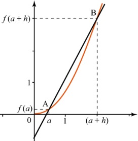

# Première : Dérivation et applications

## Exercice n° : Ecrire la liste des coefficients directeurs des sécantes pour un pas donné
`Difficulté : Moyenne`  
`Prérequis : Les listes`  
`Programme officiel`

On considère $`\mathcal{C}`$ la courbe représentative d'une fonction $`f`$ dans un repère, $`A`$ un point d'abscisse $`a`$ de $`\mathcal{C}`$ et $`B`$ celui d'abscisse $`a+h`$. 

Compléter la fonction ci-dessous pour qu'elle permette de calculer la liste des coefficients directeurs des sécantes (ou cordes) (AB) pour h variant de 1 à 0 avec un pas de 0,01. 

@[la liste des coefficients directeurs des sécantes pour un pas donné]({"stubs": ["Premiere/Derivation/liste_coeff.py"], "command": "python3 Premiere/Derivation/liste_coeff_Test.py"})
