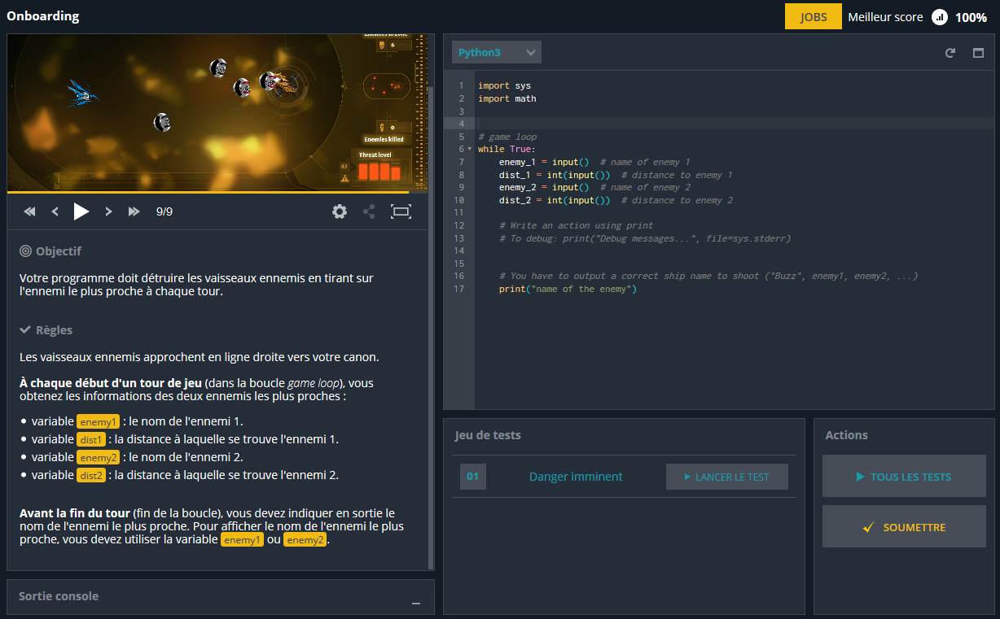

# Projet : Combat d'intelligences artificielles sur Codingame

L'idée de ce projet est de proposer aux élèves de créer des intelligences artificielles pour jouer à un jeu contre d'autres intelligences artificielles. Pour cela on peut utiliser le site [codingame](https://www.codingame.com/multiplayer/bot-programming) qui propose une section de combat de bots extrêmement bien faite et qui, en plus, est en français.

Le but de cette page est de présenter le mode de fonctionnement de ces combats d'IA et dans les pages qui suivent, proposer des kits de démarrage pour certains d'entre eux.

## Pour bien commencer

Avant de lancer des élèves sur ce genre de projet, il faut absolument que tout le monde (enseignant et élèves) soit à l'aise avec l'environnement codingame et donc préparer le terrain. Pour cela, il vaut mieux :

- Être sûr que l'élève est à l'aise avec les connaissances de base : Condition, boucles, listes.
- S'inscrire et faire quelques puzzles de niveau facile qu'on peut trouver dans la partie [entrainement](https://www.codingame.com/training/easy) du site. En effet, l'environnement Codingame est très particulier car les données qui proviennent du jeu sont récupérées grâce à la fonction `input` et nos réponses sont renvoyées par la fonction `print`.  
Le mieux pour débuter est de choisir ceux créés par Codingame car ils sont traduits en francais et souvent plus aboutis que ceux proposés par la communauté. On peut les reconnaitre au fait qu'il n'y a pas le profil du créateur qui s'affiche sur l'image de présentation (comme par exemple "Power of Thot", "Temperatures", "Chevaux de courses"...).  
Conseil important : Pour progresser, il ne faut surtout pas hésiter à regarder les réponses des autres utilisateurs (accessibles quand on a réussit le puzzle à 100%) pour voir d'autres façon de programmer et apprendre de nouvelles fonctions ou techniques.
- Revenons au combat d'IA : Avant tout, il faut bien choisir le jeu et une fois le choix fait, s'y tenir car les idées viennent au fur et à mesure et cela prend du temps. Pour le choisir, on peut lire sur la page de présentation les notions utilisées, des liens utiles vers les notions clés qui permettent d'aller haut dans le classement et parfois des liens vers des articles écrits par les plus hauts classés sur leurs tactiques. C'est très instructif pour réellement progresser quand on arrive à court d'idées.  
Pour avoir une idée encore plus précise, on peut rejoindre le combat et lire les règles plus précisément. 

Une fois le jeu choisi :
- A moins de ne pas en être capable et d'avoir des élèves qui pourront être totalement autonomes, il vaut mieux tester soit même le jeu pour voir la difficulté, les problèmes qu'ils risquent de rencontrer, ce qu'il sera necessaire d'apporter comme connaissance, ...
- Fixer les objectifs : Pédagogiquement, les combats d'IA vont permettre d'introduire assez naturellement beaucoup de notions importantes en programmation comme l'importance de bien rédiger un code (commentaires, bon choix des noms, création de fonctions), les dictionnaires, les classes, les algorithmes classiques (recherche de chemins, ...). Il faudra donc surement leur apporter des compléments soit avant, soit au fur et à mesure des besoins.  
- Autre objectif à fixer : La ligue visée. En effet le classement est divisé en ligue : Les ligues bois sont en général là pour prendre en main les règles et rajouter progressivement de la difficulté en rajoutant des règles. Le vrai challenge commence donc en ligue bronze. Selon les tournois, les élèves pourront donc soit viser un bon classement dans la ligue bronze soit en ligue argent. La ligue or est souvent hors de portée sans de réelles connaissances dans des algorithmes spécifiques (minimax, génétiques...) et optimisations.

Il est important de fixer des objectifs (quitte à les faire évoluer si les élèves le souhaitent) car une fois atteint, on peut considérer le projet terminé sinon on peut vite s'enliser dans des idées d'IA qui ne peuvent pas aboutir. Et le seul moyen de réellement progresser dans le classement est de sortir de l'artillerie lourde d'un point de vue théorique que les élèves ne pourront pas forcément assimiler.

## Les spécificités de Codingame

Une des particularités de tous les puzzles présents sur Codingame est le fait que les données d'entrée sont obtenues via la fonction `input()`. Prenons comme exemple le premier puzzle qu'on résout sur Codingame et qui s'appelle Onboarding. Voici une capture d'écran : 

Sur la gauche se trouve l'énoncé où figure en particulier les entrées (celles qu'on récupère avec la fonction `input()`) et les sorties que l'on doit renvoyer avec `print`.
Sur la droite se trouve en haut la zone où on tape notre code et en dessous les boutons pour lancer des tests sur notre code. Quand celui ci semble fonctionner sur tous les tests, on le soumet pour avoir notre score.

On peut voir sur cet exemple comment fonctionne la récupération des entrées : L'énoncé nous annonce qu'à chaque tour de jeu, nous sont donnés 4 variables : enemy_1, dist_1, enemy_2 et dist_2. Pour les récupérer et pouvoir les utiliser, chaque appel de `input()` nous donnera la variable suivante. Autrement dit le premier appel nous donne la première etc.

Une remarque importante : Le résultat d'`input()` est toujours une chaine de caractères. Pour la traduire en nombre (comme pour dist_1 et dist_2) on lui applique `int` (qui traduit en entier) ou `float` (si on veut un flottant).  
Quelques fois la donnée en entrée représente une ligne d'un tableau sous la forme "1 2 3" par exemple. Pour la transformer en une liste ["1", "2", "3"], il suffit d'utiliser `input().split()`.

Autre remarque importante : Pour débugguer, on a besoin d'afficher certaines variables. Si on le fait avec `print` directement cela va interférer avec ce qui est attendu par le programme comme réponse. Pour contourner cela, on va afficher ce que l'on souhaite mais sur le canal des erreurs. Pour cela, il faut modifier un peu notre fonction `print` sous la forme : `print("Debug messages...", file=sys.stderr)` (C'est ce qui est rappelé systématiquement en commentaire dans le code de base de chaque puzzle comme on peut le voir sur la capture d'écran précédente).  
Ainsi si je veux afficher à chaque tour de jeu le nom et la distance du premier ennemi, j'écrirais `print(enemy_1,dist_1,file = sys.stderr)` ce qui aura pour effet de les afficher en rouge dans la console.

## Un peu d'aide 

Ce n'est pas toujours facile de se lancer dans un combat d'IA la première fois car il y a beaucoup plus d'entrées que dans les puzzles d'entrainement et cela demande du recul pour savoir comment bien les gérer. C'est pour cela que vous pourrez trouver des kits de démarrage pour certains combats d'IA dans les pages qui suivent. Le but étant de mettre à disposition une gestion des entrées plus lisible grace à des fonctions ou des classes plus parlantes. Pour les combats d'IA les plus récents, des kits de démarrage sont accessibles via la page de présentation.
