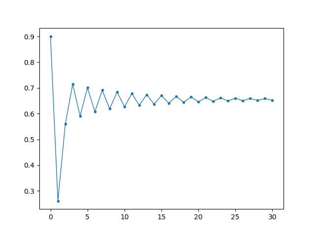
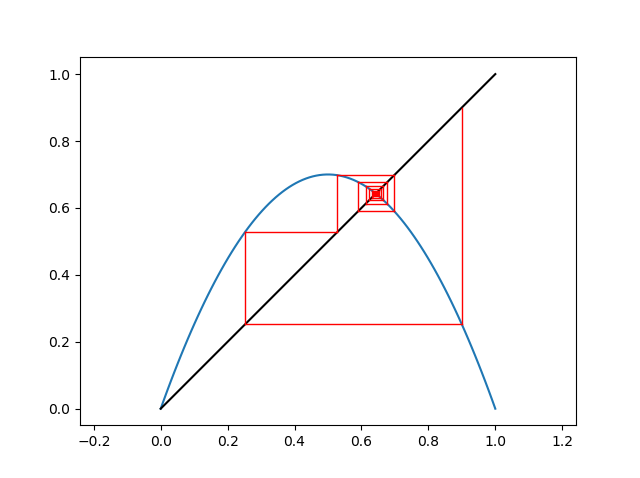

# La suite logistique
`Difficulté : de Facile à Difficile`  
`Prérequis : Les listes`

La suite est très intéressante à étudier car c'est un des exemples les plus simples qui permettent d'observer ce que l'on appelle le chaos. C'est l'équivalent en physique du double pendule : un phénomène simple et pourtant imprévisible. On pourra lire [Wikipédia](https://fr.wikipedia.org/wiki/Th%C3%A9orie_du_chaos) pour plus d'information sur la théorie du Chaos.

Le but de cette page est donc de présenter la suite logistique et toucher du doigt son coté chaotique.

## Définition de la suite
`Difficulté : Facile`

On appelle suite logistique la suite définie pour un réel $`\mu>0`$ par $`u_{n+1}=\mu u_n(1-u_n)`$.

Créer une fonction `u(mu,u0,n)` qui prend en entrée le paramètre $`\mu`$ (mu), le premier terme $`u_0`$ et un entier ***n*** et renvoie en sortie la ***liste*** des termes de la suite de $`u_0`$ jusqu'à $`u_n`$.

@[Définition des suites]({"stubs": ["TP/logistique.py"], "command": "python3 TP/logistique_Test.py"})

---

## Représentation graphique I
`Difficulté : Facile`

Une première façon de représenter notre suite est de manière classique c'est à dire n selon les abscisses et $`u_n`$ selon les ordonnées.

Créer une fonction `dessiner(mu,u0,n)` qui affiche avec matplotlib les points associés à la suite allant de $`u_0`$ jusqu'à $`u_n`$. On pourra utiliser la fonction `plt.plot(X,Y,".-",linewidth=1)` pour afficher les points et les relier. Le résultat devra ressembler à 

> Remarques : Il n'y a pas de vérificateur car c'est une fonction graphique.  
Ne pas oublier de copier coller votre fonction `u(mu,u0,n)`.  
Pour la dernière courbe affichée, on peut voir que plus la valeur de $`\mu`$ augmente, plus la suite devient chaotique dans le sens où il devient difficile de prédire la valeur de $`u_n`$ alors que pour  $`\mu=1,6`$, c'est très facile vu qu'elle se "stabilise" autour d'une seule valeur.

@[Représentation graphique 1]({"stubs": ["TP/logistique_graphique1.py"], "command": "python3 TP/logistique_graphique1_Test.py"})

## Représentation graphique II
`Difficulté : Difficile`

Nous allons à présent représenter notre suite par sa représentation dite "en escalier". Cela ressemble à ceci pour $`mu=2.8`$ et $`u_0=0.9`$ : 

On y représente la fonction $`f(x) = \mu x(1-x)`$ ainsi que la droite $`y=x`$.  Pour dessiner cette représentation, voici la démarche :  
On part de $`x=u_0`$, pour obtenir graphiquement la valeur de $`u_1`$, il suffit de regarder sur l'axe des ordonnées la valeur de $`f(u_0)`$. Le problème est que pouvoir refaire la même opération, il faudrait pouvoir situer $`u_1`$ sur l'axe des abscisses. Un première façon serait de prendre un compas et reporter la longueur mais on peut faire plus simple avec simplement une règle : On reporte horizontalement la valeur de $`u_1`$ sur la droite $`y=x`$ (puisque les points de cette droite on même abscisse et ordonnée) puis on redescend vertivalement sur l'axe des abscisses pour avoir notre valeur $`u_1`$ sur l'axe des abscisses.  
On recommence ainsi de suite pour calculer $`u_2`$, $`u_3`$...

Dans la pratique, comme sur la figure ci-dessus, on enchaine directement les traits sans aller aux axes. Cela donne à chaque fois les deux étapes :
- On joint verticalement le point $`(u_i,u_i)`$  au point $`(u_i,u_{i+1})`$.
- On joint horizontalement le point $`(u_i,u_{i+1})`$ au point $`(u_{i+1},u_{i+1})`$.

A vous maintenant de compléter la fonction `dessiner(mu,u0,n)` pour qu'elle affiche la représentation en escalier de la suite logistique c'est à dire dessiner la foncion $`f`$, la droite $`y=x`$ et "les escaliers" formés par les termes de la suite selon la description précédente.

Remarques : On peut observer que pour les deux premiers graphiques, la suite converge vers un point, pour les deux suivantes, elle devient plus complexe et oscille entre plusieurs points. Enfin, pour la dernière, on peut voir qu'elle ne se rapproche de plus aucun point en particulier mais au contraire, s'étale sur tout un intervalle de valeurs.

@[Représentation graphique 2]({"stubs": ["TP/logistique_graphique2.py"], "command": "python3 TP/logistique_graphique2_Test.py"})

---

## Sensibilité aux conditions initiales
`Difficulté : Moyenne`

Maintenant, nous allons nous intéresser au caractère chaotique de cette suite. On a pu voir grâce aux représentations précédentes que la suite devient de moins en moins stable au fur et à mesure que $`mu`$ augmente. Pour de faibles valeurs, elle converge vers une limite, puis lorsque $`\mu`$ augmente entre 3 et 3,5, elle commence à osciller entre plusieurs points pour finalement se répartir sur tout un intervalle lorsque $`mu`$ devient trop grand. Ce n'est pourtant pas en ce sens que l'on emploie le terme chaotique pour cette suite.

En effet, un suite est dite chaotique lorsqu'elle est sensible aux conditions initiales. Concrètement, cela signifie que si on part de deux conditions initiale très proches $`u_0`$ et $`u_0+\epsilon`$, on ne sera pas forcément proche (voir même très éloignées) pour des valeurs suivantes de $`(u_n)`$.

Prenons un exemple non chaotique : je considère la suite dont la relation de récurrence est $`u_{n+1}=0.9 u_n-4`$.   
Si je commence avec $`u_0=3`$ alors $`u_{50}=-39.77838766608525`$.  
Si je commence avec $`u_0=2.9999999999`$ alors $`u_{50}=-39.778387666085756`$.  
La différence n'est pas flagrante...

Pour notre suite :  Pour $`\mu=4`$
Si je commence avec $`u_0=0.9`$ alors $`u_{50}=0.5600367632223772`$.  
Si je commence avec $`u_0=0.89999999999`$ alors $`u_{50}=0.2903856953167539`$. 
On est parti de nombres extrêmement proches et pourtant les résultats sont très éloignés. C'est pour cela qu'on dit que cette suite est chaotique.  
Cela pose un problème concret pour le calcul : Si vous faites ces calculs avec votre calculatrice, vous ne trouverez pas les mêmes résultats. En effet, la calculatrice n'ayant pas les mêmes chiffres significatifs que python, vous aurez des résultats fondamentalement différents.

---

## Diagramme de bifurcation
`Difficulté : Difficile`

---

## Prolongements possibles

On pourra observer les comportements d'autres suites comme par exemple $`u_{n+1}=\mu sin(u_n)`$ ou $`u_{n+1}=\mu- u_n^2`$.

Un prolongement possible est aussi l'étude de la fonction logistique $`f(x)=\mu x(1-x)`$ mais sur l'ensemble des nombres complexes. On obtient alors l'ensemble de Mandelbrot.
