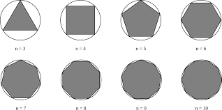

# Approximation de $`\pi`$ par des polygones réguliers
`Difficulté : Moyenne`  
`Prérequis : Suites, Trigonométrie (pour les justifications)`

Le but de cette page est de présentée la méthode d'Archimède pour approximer la valeur de $`\pi`$ en utilisant des polygones réguliers inscrits dans le cercle.  
L'idée est de considérer un cercle de rayon 1. Son périmètre est alors de $`2\pi`$. Si on trace un polygone régulier inscrit dans ce cercle, avec un nombre de coté suffisamment grand, son périmètre devrait alors être proche de la valeur $`2\pi`$.

## Première méthode

En partant de la remarque précédente, nous allons donc calculer le périmètre d'un polygone régulier inscrit dans un cercle de rayon 1 en fonction de son nombre de côté pour obtenir une approximation de $`2\pi`$ puis diviser le résultat par 2 pour obtenir celle de  $`\pi`$.

> Question mathématique : On peut trouver sur [Wikipédia](https://fr.wikipedia.org/wiki/Polygone_r%C3%A9gulier) que la mesure d'un côté d'un polygone à n côtés est $`c = 2 sin\left(\dfrac{\pi}{n}\right)`$.  
Prouver le puis en déduire la valeur du périmètre en fonction de $`n`$.

Créer un programme utilisant la formule ci-dessus qui prend en entrée un entier $`n`$ et donne en sortie une approximation de $`\pi`$. (Penser à diviser par 2 le périmètre !)

@[Première méthode]({"stubs": ["TP/approx_pi_1.py"], "command": "python3 TP/approx_pi_1_Test.py"})

---

#### Remarques :

Cette première méthode était plus un échauffement informatique qu'une réelle méthode car elle est totalement abérrante : En effet, pour approximer $`\pi`$, on utilise une formule où il faut connaitre $`\pi`$ ... Cependant c'est une méthode qui pourrait correspondre à un reflexe : on a une idée (utiliser les périmètres des polygones pour approximer celui du cercle), on cherche sur internet des formules déjà existantes et on les utilise dans notre programme. Comme python possède en mémoire une approximation de $`\pi`$, on ne se rend même pas compte du problème...

---

## La méthode d'Archimède

L'idée d'Archimède est de partir d'un polygone régulier (par exemple le carré) et trouver un lien entre le périmètre de ce polygone et celui d'un polygone qui aurait deux fois plus de coté et aurait un sommet sur deux en commun avec le polygone précédent. 

Ainsi, si on part d'un carré, on va construire une suite de polygones ayant 4 cotés puis 8 puis 16... c'est à dire des puissances de 2. On notera, pour n>1, $`c_n`$ la longueur du polygone régulier à $`2^n`$ cotés inscrits dans le cercle de rayon 1.

> Question mathématique : Montrer qu'on a la relation de récurrence suivante, pour n>1 :  $`c_{n+1}=\sqrt{\dfrac{c_n^2}{4}+\left(1-\sqrt{1-\dfrac{c_n^2}{4}}\right)^2}`$.

Créer une fonction qui prend en entrée n et donne en sortie une approximation de $`\pi`$ en utilisant $`c_n`$ pour calculer le demi-périmètre.

> Remarques : Faire bien attention aux différents pièges : La suite commence par $`c_2=\sqrt{2}`$ et le nombre de côtés est $`2^n`$.  

@[Méthode d'Archimède]({"stubs": ["TP/approx_pi_2.py"], "command": "python3 TP/approx_pi_2_Test.py"})

---

## Approfondissement possibles

On ne peut pas dépasser 15 décimales de base en python mais il est possible d'importer des modules qui augmentent la précision des calculs. Faites des recherches sur internet pour trouver un module adapté puis créer un programme qui permet d'afficher les 100 premières décimales de $`\pi`$ en utilisant la méthode d'Archimède.
