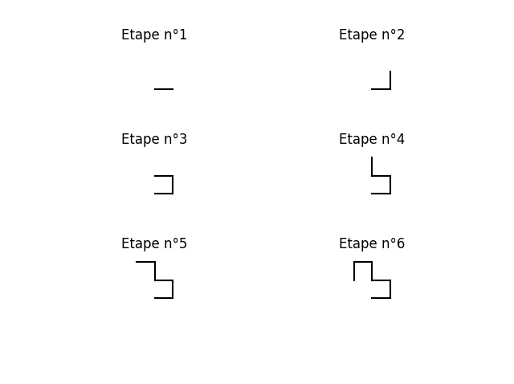

# La courbe du dragon
`Difficulté : Moyenne à difficile`

On a déjà parlé de la courbe des pliages d'un papier dans un exercice. Pour rappel : 

Si l'on prend une bande de papier que l'on plie en deux, toujours dans le même sens (à gauche par exemple), la forme résultante présente une suite de changements de direction que l'on peut coder par G pour gauche et D pour droite. 
On obtient alors la suite : 
1. G 
2. G G D 
3. G G D G G D D
4. G G D G G D D G G G D D G D D 
5. ... 

Cette suite de lettre s'appelle la suite des pliages d'un papier et si on la représente, on obtient la courbe du dragon. Vous pouvez regarder sur [Wikipédia](https://fr.wikipedia.org/wiki/Suite_de_pliage_de_papier) pour plus d'informations et de [belles images](https://fr.wikipedia.org/wiki/Courbe_du_dragon). 

Le but de cet exercice est de représenter cette courbe.

### Première étape : La suite des pliages d'un papier.

On a déjà vu des manières de construire cette suite mais qui ne sont pas très efficaces si on veut la suite pour un nombre de pliage grand (car il fallait calculer à chaque fois les pliages en partant du début).

Pour obtenir le ***k***-ième terme de cette suite (attention : on commence à k=1 ici, autrement dit le 3ieme terme est D.), voici ce qu'il faut faire :
+ Mettre ***k*** sous la forme $`k=m2^p`$ où ***m*** est un nombre impair. On a déjà fait un exercice la dessus, s'y reporter si besoin.
+ Si `m%4==1` alors le ***k***-ième terme est un 'G' sinon c'est un 'D'.

Créer une programme ***pliage*** qui prend un entier ***k*** en entrée et affiche le ***k***-ième terme de la suite des pliages d'un papier (en commençant par un 'G' si ***k***=1).

> Entrée : Un entier non nul ***k***.
  
> Sortie : La ***k***-ème lettre de la suite des pliages d'un papier donc un "G" ou un "D" renvoyée avec `return`.
  
@[k-ième lettre de la suite des pliages d'un papier]({"stubs": ["Vrac/courbe_dragon.py"], "command": "python3 Vrac/courbe_dragon_Test.py"})
  
---
  
### Deuxième étape : Dessiner la courbe du dragon

Traçons maintenant les ***n*** premiers segments de la courbe du dragon. Pour cela, il faut procéder par étape :
1. On initialise :
    - On commence au point de coordonnées ***x***=0, ***y***=0 avec une ***direction***=0. ***direction*** désigne la direction en degré dans laquelle on se déplace par rapport à l'horizontale (mais on ne mettra pas ° dans le programme). Ainsi une direction de 90° est vers le haut, de 180° vers la gauche et de 270° vers le bas. On travaillera à 360° près (en utilisant `%360`) de sorte que la direction de -90° désigne aussi vers le bas.
    - On crée deux listes ***liste_x*** = [x] et ***liste_y*** = [y] dans lesquelles on mettra respectivement les abscisses et les ordonnées des points qu'on considère. 
2. Pour ***k*** allons de 1 à ***n***, on va répéter les étapes suivantes :
3. On avance de 1 dans la ***direction*** en partant du point de coordonnées ***x*** et ***y***. Plus précisément on aura les modifications suivantes : 
    - Si la direction est 0, ***x*** = ***x***+1. 
    - Si la direction est 90, ***y*** = ***y***+1.
    - Si la direction est 180, ***x*** = ***x***-1.
    - Si la direction est 270, ***y*** = ***y***-1.
4. On rajoute ***x*** à ***liste_x*** et ***y*** à ***liste_y***.
5. On calcule ***pliage(k)*** (où pliage est la fonction de la partie précédente qu'il faudra copier coller). 
    - Si ***pliage(k)*** ="G", il faut tourner à gauche c'est à dire augmenter la ***direction*** de 90° à 360° près (ne pas oublier le `%360`).
    - Si ***pliage(k)*** ="D", il faut tourner à droite c'est à dire diminuer la ***direction*** de 90° à 360° près (ne pas oublier le `%360`).
6. On recommence à l'étape 2 en augmentant ***k*** de 1.
7. On dessine les segments joignant les points dont les coordonnées sont dans ***liste_x*** et ***liste_y***. Pour cela, on utilisera la fonction `plt.plot(liste_x,liste_y, color="black")`. On pourra trouver sur internet des options pour modifier la couleur de tracé par exemple ou le style de trait de cette fonction.
Voici les premières étapes :

Créer un programme qui prend en entrée ***n*** et affiche la courbe du dragon en suivant les étapes précédentes. Pour pouvoir vérifier votre programme vous devez en plus rajouter `return liste_x,liste_y` en dernière ligne (après la boucle).

@[courbe du dragon]({"stubs": ["Vrac/courbe_dragon_plot.py"], "command": "python3 Vrac/courbe_dragon_plot_Test.py"})
